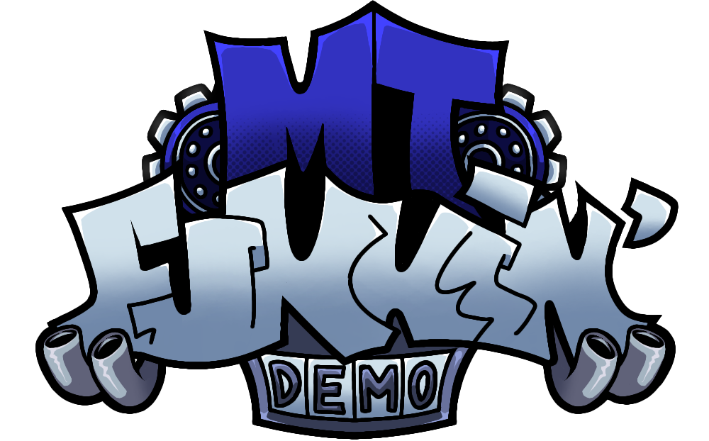

<!--This is the markdown readme. View the pretty format on the webpage
-->

<h1 align="center">
# M/T Funkin'
</h1>
If you just want to play the mod, download it [here](https://gamebanana.com).

# Building From Source

You must have [the most up-to-date version of Haxe](https://haxe.org/download/) (4.3.1+) in order to compile.

Install [Visual Studio Code](https://code.visualstudio.com/download).

For language support, debugging, linting, and documentation, install the [Vs Haxe Extension Pack](https://marketplace.visualstudio.com/items?itemName=vshaxe.haxe-extension-pack).

For Lime / OpenFL project support, install the [Lime Extension](https://marketplace.visualstudio.com/items?itemName=openfl.lime-vscode-extension).

`windows` For compiling the game on windows, install [Visual Studio 19](https://visualstudio.microsoft.com/vs/older-downloads/#visual-studio-2019-and-other-products) and ONLY these components:
```
MSVC v142 - VS 2019 C++ x64/x86 build tools
Windows SDK (10.0.17763.0)
```

# Credits:

M/T Funkin' is not assosiated with The Funkin' Crew.

## M/T Funkin' Team
* Sway - Director, Artist, Writer
* Nick - Coder
* Just Jack - Coder
* TonyTheRappingCat - Voice actor
* RoFoS - Musician
* Ziffer - Musician
* Ralf - Charter
* FraGer - Artist
* Comix Guy - Artist, Animator
* Dizzy - He knows why he is here

## Psych Engine
* Shadow Mario - Programmer/Owner of Psych
* shubs - New Input System
* PolybiusProxy - HxCodec Video Support
* Keoiki - Note Splash Animations

## Funkin' Crew
* ninjamuffin99 - Programmer/Owner
* PhantomArcade - Artist, Animator
* evilsk8r - Artist
* kawaisprite - Composer